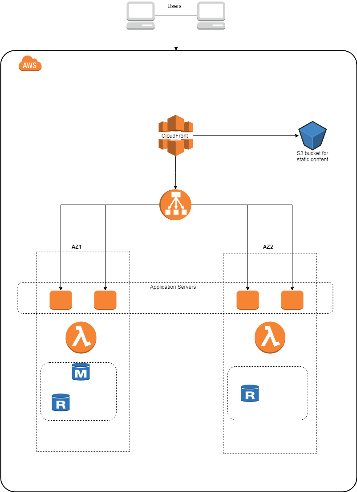

# Project Title

This project contains scripts to launch a stack on AWS for a simple web application . 


## Prerequisites
The lambda functions need to be tested before being deployed.
you will need to install the packages as described in the **requirements.txt** file
## Getting Started

Download the project , configure Terraform variables (default values are already there).
Navigate to the project folder and run the deploy script .
```
python deploy.py
```
