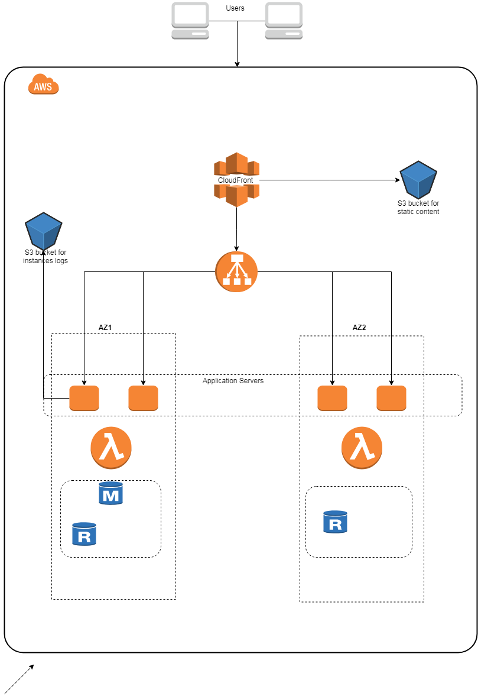

# Project Title

This project contains scripts to launch a stack on AWS for a simple web application . 


## Prerequisites
Download the project , you will need to install the packages as described in the **requirements.txt** file .
```
pip install -r requirements.txt -t path/to your lambda
```
Install [Terraform](https://www.terraform.io/downloads.html)

Configure AWS profile (Access key and Secret key)


## Getting Started

Download the project , configure Terraform variables (default values are already there).
Navigate to the project folder and run the deploy script .
```
python deploy.py
```
